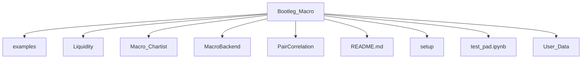

```mermaid
graph TD;
    A[Bootleg_Macro] --> B[examples]
    A --> C[Liquidity]
    A --> D[Macro_Chartist]
    A --> E[MacroBackend]
    A --> F[PairCorrelation]
    A --> G[README.md]
    A --> H[setup]
    A --> I[test_pad.ipynb]
    A --> J[User_Data]
```
